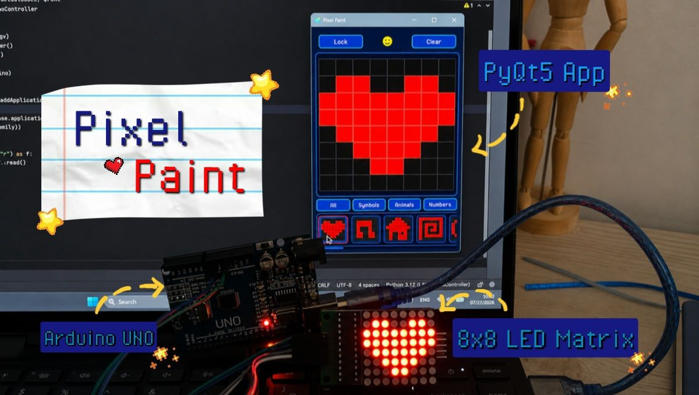

# 🎨 Pixel Paint for 8×8 LED Matrix

  

  Draw pixel art on your computer and watch it come to life on a real 8×8 LED Matrix.

## ✨ Overview
A desktop pixel editor built with **PyQt5** that lets you design 8×8 LED patterns and instantly display them on a real **MAX7219 LED Matrix** powered by an Arduino.

The application provides an intuitive painting interface, built-in pixel art templates, and real-time hardware communication, making it a fun project for experimenting with embedded systems and desktop GUI development.

## ✨ Features

- Interactive 8×8 pixel painting canvas
-  Lock / Unlock editing mode
- Random predefined pattern generator
- One-click canvas clearing
- Built-in pattern gallery with categories
- Live pattern previews
- Tooltips for every button (and predefined pattern)
- Real-time communication with Arduino
- Modular PyQt5 project structure

## ✨ Hardware Components

- Arduino Uno
- MAX7219 8×8 LED Matrix Module
- USB Connection (Serial Communication)

## ✨ Technologies Used

- Python
- PyQt5
- Arduino (C++)
- Serial Communication (PySerial)

# ✨ Demonstration

Here's a quick look at the application's main features:

### 📌 Paint & Clear

  

---

### 📌 Lock / Unlock Canvas

  

---

### 📌 Pattern Gallery & Categories

  

---

### 📌 Random Pattern

  

---

### 🎥 Full Demo

#### PyQt Application

**Full Demo:** [FullPyqt5Demo.mp4](videos/FullPyqt5Demo.mp4)

#### Hardware Demonstration

**Full Demo:** [FullHardwareDemo.mp4](videos/FullHardwareDemo.mp4)

## 🛠️ Future Improvements

Possible improvements:
- Drag painting
- Save and load patterns
- Pattern animation support

## ✨ Author & License

**Parnian Ghorbani**

This project was created as a practice project for combining **PyQt desktop development** with **embedded systems**. The goal was to build an application that feels like a tiny pixel-art editor while controlling a real LED matrix in real time. 

This project is open-source and available for learning and educational purposes. If it helps you or inspires one of your own, I'd really appreciate a mention of this repository. :)
